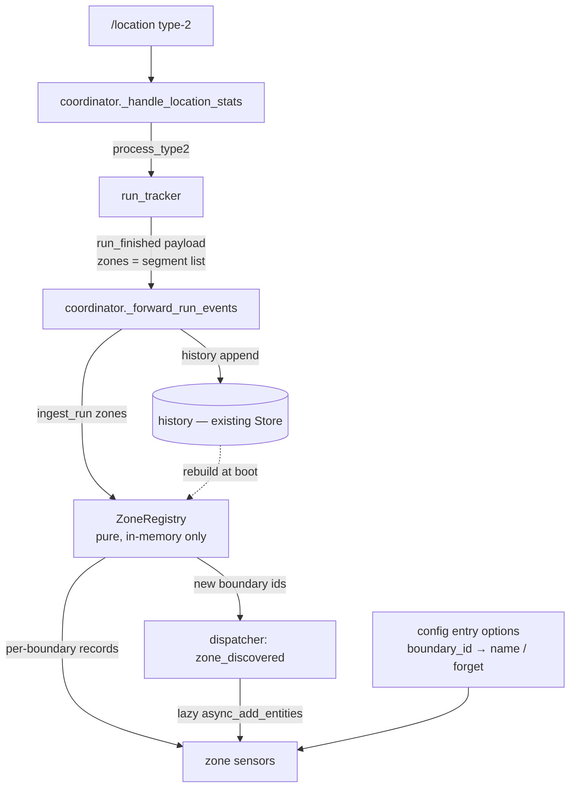

# FEAT-04 — Zone registry: one entity family per mowing zone

**Status:** design proposal for review (Fable) / arbitration (operator)
**Re-scope of:** #10 (originally filed deferred, blockers now cleared)
**Depends on:** FEAT-05 run tracker (#43), FEAT-06 session scoping (#54), BUG-06 sentinel (#39)
**Target branch:** `deploy`

---

## 1. Context and re-scope

Issue #10 was filed as a deferred tracking ticket carrying three blockers. All three are resolved (operator cross-reference on #10, 2026-07-03):

1. `currentMowProgress` vs `mowingPercentage` — settled: `current_mow_progress / 100` is per-zone (resets at boundary crossings), `mowing_percentage` is per-run (monotonic).
2. Idle-transient filter — settled: the correct filter is the layer-1 `time` ordering guard (in the coordinator), not a shape filter. Lives in FEAT-05.
3. `subtotalArea` delta semantics — settled: `subtotalArea` is run-cumulative; per-zone surface is the delta between boundary crossings.

Because the `run_tracker` (FEAT-05) already performs all the filtering, delta computation and per-zone segmentation, **FEAT-04 is now purely a consumer**: an in-memory registry + entity layer that folds the `run_finished` payload into per-zone state. No parsing, no guards, no delta math is re-implemented here — and, per the operator decision of this design round, **no dedicated persistence** either (see §9).

Each `run_finished` event payload already carries everything needed:

```python
{
    "result": "completed" | "interrupted",
    "start_time": int,          # firmware epoch ms
    "end_time": int,            # firmware epoch ms
    "duration_ms": int | None,
    "session_area": float | None,
    "mow_start_type": int | None,
    "zones": [                  # ordered list of zone *segments*
        {
            "boundary_id": int,       # firmware id (non-sequential)
            "first_time": int,        # epoch ms, segment entry
            "last_time": int,         # epoch ms, segment exit
            "cmp_max": int,           # max current_mow_progress, 0..10000
            "sub_entry": float,       # subtotalArea (m²) on entry
            "sub_exit": float,        # subtotalArea (m²) on exit
        },
        ...
    ],
}
```

**Key subtlety already handled by the tracker** (`_update_zone`): a single run can contain **several segments with the same `boundary_id`** — the robot leaves a zone and comes back (interleaving, or an intra-run recharge dock). The registry must therefore *group segments by boundary* before aggregating. `boundary=0` (BUG-06 session-init sentinel) never appears in the list.

---

## 2. Scope

**In scope (this design):**

- A pure, HA-agnostic `ZoneRegistry` class (mirrors `run_tracker.py` testability), fed by the `run_finished` events the coordinator already forwards, and **rebuilt from `history` at startup** — it holds no persisted state of its own.
- Per-zone entity family: last-mow surface, duration, last-mowed timestamp, plus a zone-size estimate derived from the last complete pass.
- An aggregate `zones` sensor.
- Dynamic (lazy) entity creation as new boundaries are discovered.
- Friendly zone naming **and** zone removal via an options flow.

**Deferred to a later phase — separate PR:**

- Per-zone posture **bounding box** (`bbox`) and the `navimow.reset_posture_extents` service. These require joining the type-1 position stream (postureX/Y, ~2 s) with the type-2 boundary stream (~30–90 s) — a distinct piece of plumbing with recorder-write implications. Split out so this ships clean. See §11.

**Non-goals:**

- No changes to `run_tracker.py`, `location.py` or the guard layers. The tracker's `zones` payload is the contract.
- No re-derivation of per-zone surface from raw `stats`. Everything comes from `run_finished`.
- No lifetime odometers (`total_surface`, `mow_count`) — explicitly out, per operator decision. They are the only fields a 50-run-capped history cannot reconstruct, and the operator does not need them.

---

## 3. Architecture



The registry sits exactly where `history` / `last_finished_run` are already updated — inside `_forward_run_events`, on the `run_finished` branch. One extra call, no new save path (it has nothing of its own to save), no new coordinator tick coupling. At startup it is a pure projection of the existing `history`.

---

## 4. Data model

A pure class, no HA imports, unit-testable in isolation (the `run_tracker.py` pattern):

```python
# zone_registry.py

# A pass whose cmp_max reaches this counts as a "complete" pass of the
# zone and refreshes size_estimate_m2. Evidence (Opus, 763-packet archive
# 22–27 May + all fork diags): on all 8 observed completions, cmp reaches
# exactly 10000 — the firmware does not close a zone before 10000. The
# 9901 seen in the committed 34-line multizone slice was a SAMPLING
# artifact: that slice missed the 10000 peak packet. A lossy live stream
# can miss it too, so the threshold must sit *below* 10000 (a strict
# `== 10000`, or 9999, would drop that real complete pass and leave
# size_estimate unset). 9900 gives 100 counts of tolerance for a missed
# peak while staying far above the partial-pass ceiling (~7000 in the
# data), and bounds a would-be near-interrupt error to ~1 % (the jitter
# floor, §6).
COMPLETE_PASS_CMP = 9900


@dataclass
class ZoneRecord:
    boundary_id: int
    last_mowed_ms: int | None = None      # this zone's own last exit time
    last_surface_m2: float | None = None  # Σ(sub_exit − sub_entry), precise
    last_duration_s: int | None = None    # in-zone mowing time, recharge incl.
    last_cmp_max: int = 0                  # completeness of last pass, 0..10000
    size_estimate_m2: float | None = None  # LAST complete pass, precise (m²)
    last_result: str | None = None         # "completed" / "interrupted"
    # Deferred (posture bbox):
    bbox: dict[str, float] | None = None   # {x_min,y_min,x_max,y_max}, meters


class ZoneRegistry:
    def __init__(self) -> None:
        self.zones: dict[int, ZoneRecord] = {}

    def ingest_run(self, run_finished: dict) -> list[int]:
        """Fold one run_finished payload. Returns the boundary ids seen
        for the FIRST time (for lazy entity creation)."""
        ...

    def rebuild(self, history: list[dict]) -> None:
        """Replay the whole history in chronological order. Because runs
        are appended oldest→newest, the last complete pass of each zone
        naturally wins size_estimate_m2 — the estimate auto-corrects
        after a zone is reshaped in the app (see §12 D-size)."""
        self.zones.clear()
        for rf in history:
            self.ingest_run(rf)

    def forget(self, boundary_id: int) -> bool:
        """Drop a zone's in-memory record (options-flow removal)."""
        return self.zones.pop(boundary_id, None) is not None
```

Why these fields:

- `last_surface_m2` is the honest state — "how much did we cut here last time". It drops on an interrupted pass, and `last_cmp_max` says so.
- `size_estimate_m2` is the **zone-size estimate**, taken from the *last complete pass* (`cmp_max >= COMPLETE_PASS_CMP`). It is a last-wins assignment, not a max — so if the zone is resized in the app, the next complete pass overwrites it and the estimate tracks reality with no sticky state to reset.
- `last_cmp_max` lets the dashboard flag "this zone was only 60 % mown last time".

No cumulative counters. The registry is fully reconstructible from `history`; nothing here needs persisting.

---

## 5. The fold (`ingest_run`)

```python
def ingest_run(self, rf: dict) -> list[int]:
    result = rf.get("result")
    segments = rf.get("zones") or []

    by_boundary: dict[int, list[dict]] = defaultdict(list)
    for seg in segments:
        bid = seg.get("boundary_id")
        if bid:                       # None / 0 defensively excluded
            by_boundary[bid].append(seg)

    newly_seen: list[int] = []
    for bid, segs in by_boundary.items():
        if bid not in self.zones:
            self.zones[bid] = ZoneRecord(boundary_id=bid)
            newly_seen.append(bid)
        rec = self.zones[bid]

        surface = sum(
            s["sub_exit"] - s["sub_entry"]
            for s in segs
            if s.get("sub_exit") is not None and s.get("sub_entry") is not None
        )
        # D1: in-zone mowing time. Σ per-segment spans. An intra-zone
        # recharge dock does NOT open a new segment (the tracker keeps
        # extending the same zone), so the recharge pause is bracketed
        # inside first_time..last_time and IS included — which is the
        # operator's intent. What this sum excludes is only time spent in
        # OTHER zones between two segments of this one.
        duration_ms = sum(
            s["last_time"] - s["first_time"]
            for s in segs
            if s.get("last_time") is not None and s.get("first_time") is not None
        )
        cmp_max = max((s.get("cmp_max") or 0) for s in segs)

        # Fable correction: "last mowed" is when the robot last cut HERE,
        # i.e. this boundary's own last exit — NOT the run's end_time. On
        # a 1 → 3 run, using end_time would stamp zone 1 with the moment
        # zone 3 finished (30–60 min late, semantically wrong).
        seg_last_times = [
            s["last_time"] for s in segs if s.get("last_time") is not None
        ]
        rec.last_mowed_ms = max(seg_last_times) if seg_last_times else None
        rec.last_surface_m2 = round(surface, 2)
        rec.last_duration_s = round(duration_ms / 1000)
        rec.last_cmp_max = cmp_max
        rec.last_result = result
        if cmp_max >= COMPLETE_PASS_CMP:
            rec.size_estimate_m2 = round(surface, 2)   # last complete wins
    return newly_seen
```

Pure, deterministic, no clock, no HA — exactly like `run_tracker`. Exercised by feeding hand-built `run_finished` dicts and asserting on `self.zones`. `rebuild()` is the same method in a loop.

---

## 6. Entities

Anchored on `boundary_id` in the `unique_id`, so an app rename (which does not change the firmware id) keeps history intact, and a vanished id can be pruned via the options flow.

| Entity | State | Class / unit | Key attributes |
| --- | --- | --- | --- |
| `sensor.<slug>_zone_<id>` | `ceil(last_surface_m2)` | area, m² (int) | `boundary_id`, `size_estimate` (ceil), `last_surface_precise`, `last_cmp_max`, `last_result`, `bbox` (deferred) |
| `sensor.<slug>_zone_<id>_duree` | `last_duration_s` | duration, s | `boundary_id` |
| `sensor.<slug>_zone_<id>_derniere_tonte` | `last_mowed_ms` → dt | timestamp | `boundary_id`, `last_result` |
| `sensor.<slug>_zones` (aggregate) | zone **count** | — | `zone_ids`, `total_area` (ceil, Σ size estimates), per-zone summary map, `global_bbox` (deferred) |

`unique_id` scheme: `f"{DOMAIN}_{device.id}_zone_{boundary_id}"`, `..._zone_{boundary_id}_duration`, `..._zone_{boundary_id}_last_mowed`, `..._zones`.

The aggregate's `total_area` is the **spatial** sum of the per-zone size estimates (≈ the whole garden = prunier + figuier), computed on the fly from `registry.zones` — not a lifetime odometer. Aggregate state is the zone **count** (a small stable badge); the interesting numbers live in attributes (decision D-agg in §12).

**Surface rounding — up to the next m² (`math.ceil`).** All surface-bearing outputs (`sensor.<slug>_zone_<id>` state, its `size_estimate` attribute, and the aggregate `total_area`) are presented as `math.ceil(precise_value)`, per operator decision. The registry keeps the **precise** float (`last_surface_precise` is exposed as an attribute), so the display can be refined later — e.g. banker's rounding, or a hysteresis band — without any data loss, if the measured jitter proves distracting. `suggested_display_precision` is *not* used for these, because it rounds to nearest, not up; the ceil is applied in `native_value`.

**Measured jitter (Opus, 763-packet archive).** On clean, from-`sub=0` complete passes, the per-zone surface varies run-to-run: zone 1 (prunier) 227–228 m² (±1, ~0.5 %), zone 3 (figuier) 123–125 m² (±2, ~1.6 %). This is real (non-deterministic mowing path, band overlap), small, and self-correcting under the last-wins `size_estimate` — so it validates the D-size choice. At the m²-ceil granularity it will occasionally flip a zone's displayed value by 1 m² between runs; that is the "affiner si jitter" trigger to revisit, not a correctness issue.

**Gate is `cmp_max`, not `mp`.** `size_estimate` keys off `cmp_max` (zone-scoped progress), never `mowing_percentage` (run-scoped). The 2026-05-27 figuier run closed the *task* at `mp = 99` yet the *zone* reported `cmp = 10000` — corroborating BUG-09's finding that `mp` caps at 99 or 100 depending on the task, while `cmp` reliably marks zone completion. A `mp`-based gate would have missed that complete pass.

Because the registry is loaded (rebuilt from `history`) *before* entities are added, every zone value is present at first `native_value` — no `RestoreSensor` and no `unknown` window at startup. This is why HARD-02's `RestoreSensor` mechanism is not reused here: the registry *is* the source of truth.

**Naming mechanism (per-zone vs aggregate — two different code paths):**

- **Per-zone entities are dynamically named** ("Prunier surface", "Figuier duration"), so they **cannot** use `translation_key` — translation keys resolve statically at load. Each per-zone entity computes `_attr_name` from the options map (`zones[boundary_id]["name"]`) with a `#<id>` fallback when unmapped, and registers a listener on the config-entry options update so a rename refreshes the entity name live (`async_write_ha_state`).
- **The aggregate `sensor.<slug>_zones` is static**, so it **must** carry `translation_key`s in `strings.json` + `translations/en.json` + `translations/fr.json`. This is the PR #50 lesson (keyless entities landed nameless in production): it applies to the one static entity in this family, not to the dynamic per-zone ones.

---

## 7. Zone naming and removal (options flow)

Firmware boundary ids are opaque (`1`, `3` on the operator's install; `2` = transit corridor). The app names ("prunier" = #1, "figuier" = #3) are **not** in any MQTT payload. A single options flow handles both naming and removal:

- A config-entry option `zones: {boundary_id: {name: str}}`, editable in the HA UI. For each known `boundary_id`: a name field, plus a "forget this zone" checkbox.
- The map is the single source of truth, anchored on the id, and survives everything. The aggregate sensor and (optionally, later) BUG-06's `current_zone` resolve `#3 → "Figuier"` from it; unmapped ids fall back to `#<id>`.
- Checking "forget" drops the registry record and removes the three per-zone entities (`entity_registry.async_remove`).

This options flow **supersedes** the `navimow.forget_zone` service that #10 originally sketched — a checkbox reads better than a service call with a raw `boundary_id`. Caveat, same as any forget: if the zone still exists in the Segway app, the firmware re-announces it on the next mow and it is re-discovered. "Forget" is durable only for a zone actually removed from the map.

---

## 8. Dynamic entity lifecycle

Zones are discovered at runtime. Three moments:

- **Setup (known zones):** `_async_restore_store` already loads `history`; the coordinator calls `registry.rebuild(history)`, then `async_setup_entry` creates the entity family for every `boundary_id` present in `registry.zones`. Eager, no flicker, no separate registry store.
- **Discovery (new zone):** `ingest_run` returns `newly_seen`; the coordinator dispatches `navimow_zone_discovered_<device_id>` with the id; the sensor platform's listener calls `async_add_entities` for just that zone's family. Same lazy-add pattern the FEAT-01 issue anticipated.
- **Removal:** the options-flow "forget" drops the record and removes the entities.

The dispatch fires from `_forward_run_events`, on the loop, after `history` is updated — so a discovered zone is already in the rebuilt registry before its entities appear.

---

## 9. Persistence: none of its own

The registry keeps **no persisted state**. It is a pure projection of the existing `history` list (already stored in the run-tracker Store), rebuilt in memory at every startup via `registry.rebuild(history)`.

This is the direct consequence of dropping lifetime counters: every remaining field (`last_*`, `size_estimate`) is recomputable from the runs in `history`. On the operator's install — 2–3 zones mown almost daily, `HISTORY_MAX = 50` ≈ two months — every zone is touched on nearly every run, so no zone ages out of the window and the projection is complete. There is therefore **no store-version bump, no migration, no new save path** for FEAT-04. (Contrast the earlier draft, which persisted a per-zone aggregate — removed as redundant with `history`.)

**Completeness caveat (accepted, documented, not solved).** Registry completeness equals the history window. On an install unlike the operator's — a zone mown rarely enough to fall out of the last `HISTORY_MAX` sessions — that zone is reborn *anonymous* at its next mow (its options-map name still resolves by id, but a fresh `ZoneRecord` starts from that mow), and its previously-registered HA entities sit **orphaned** in the entity registry until the rebirth re-adds them. This is a bounded, visible limitation of the projection approach, not a bug; solving it would require the very lifetime persistence the operator declined. Flagged here so it is a known trade-off rather than a surprise.

---

## 10. Services

FEAT-04 introduces **no new service**. Zone removal is the options-flow "forget" (§7). `navimow.reset_posture_extents` ships with the deferred posture-bbox phase alongside the `bbox` it resets.

---

## 11. Deferred — posture bounding box

The `bbox` attribute and `reset_posture_extents` need per-zone posture extents, which only the type-1 stream carries (`postureX/Y`). The two streams are independent, but the coordinator holds both live: when a type-1 position arrives, the current boundary is `self.stats["boundary"]`. So the join is:

> on each accepted type-1 position, fold `(x, y)` into `registry.zones[current_boundary].bbox`.

Feasible, but: it couples the registry to the ~2 s position cadence (not just run-close), so it needs throttling and a persist-on-run-close-only policy (the bbox would then no longer be a pure `history` projection — it would need its *own* small persisted state, reopening §9 for that one field only); and `current_boundary` lags the crossing by up to one type-2 packet, mis-attributing a few early positions — acceptable for a bbox but worth documenting. Splitting it out keeps this phase strictly run-close-triggered and persistence-free.

---

## 12. Decisions

Resolved this round (✔) and still open:

| # | Decision | Outcome |
| --- | --- | --- |
| D1 | Per-zone **duration** semantics | ✔ Σ segment spans = in-zone mowing time, **intra-zone recharge included** (bracketed inside a segment; the tracker does not split on an intra-zone dock). |
| D-name | **Naming + removal** mechanism | ✔ Options flow `boundary_id → name` + "forget" checkbox; supersedes the `forget_zone` service. Feeds `current_zone` display. |
| D-size | **Size estimate** source | ✔ **Last** complete pass (`cmp_max ≥ COMPLETE_PASS_CMP`), last-wins — auto-corrects on app resize, no sticky max to reset (HARD-06 philosophy: no stability assumption that needs a manual purge). |
| D-persist | Registry **persistence** | ✔ None — projection of `history`, rebuilt at boot. |
| D-agg | Aggregate **state** | ✔ Zone **count**. `total_area` as state would rewrite on every re-estimate and add recorder noise for a near-constant number; it belongs in attributes (Fable). |
| D-transit | Transit boundary **#2** | ✔ Track it like any zone; operator names it "Transit" or forgets it. Hardcode-excluding is barred — it would violate the fork's no-hardcoded-zone-semantics rule, and #2 may be a real zone on another install (Fable). |
| D6 | `COMPLETE_PASS_CMP` value | ✔ `9900`. All 8 completions in the 763-packet archive reach cmp = 10000; the earlier `9901` was a sampling artifact of the 34-line slice, not the firmware's exit value. 100-count tolerance for a peak packet missed by a lossy live stream (the committed slice proves this happens), far above the ~7000 partial ceiling, error bounded to ~1 % (Opus + Fable). |

Decisions carry Fable's review positions; open for operator override before the implementation brief.

---

## 13. Test plan

Registry (pure, no HA):

1. `ingest_run` with one run, two boundaries → two records, correct `last_surface` = Σ deltas, returns both ids as newly-seen.
2. Interleaved segments (`[1, 3, 1]`) → boundary 1's surface and duration sum *both* of its segments (D1); the mid-gap in zone 3 is excluded from zone 1's duration. **Pins the `last_mowed` fix:** on a plain `1 → 3` run, zone 1's `last_mowed_ms` < zone 3's, and neither equals the run's `end_time`.
3. Intra-zone recharge (single segment spanning a dock) → `last_duration_s` includes the pause (D1).
4. Interrupted pass (`cmp_max = 6000`) → `size_estimate` unchanged from a prior complete pass; `last_surface` reflects the partial; `last_cmp_max = 6000`.
5. **Resize auto-correction (D-size):** complete pass at 200 m², then a later complete pass at 150 m² → `size_estimate = 150` (last-wins, not max).
6. **Threshold gate (D6):** `cmp_max = 9850` → `size_estimate` NOT updated (below 9900); `cmp_max = 9900` and `10000` → updated. Pins the boundary at 9900.
7. `boundary=0` / missing ids in the payload → excluded.
8. `rebuild(history)` on an oldest→newest list → matches ingesting the runs one by one; `size_estimate` = last complete pass in the list.
9. `forget(id)` → record gone; unknown id → returns False.

Coordinator / entities (HA harness, `pytest-homeassistant-custom-component`):

10. Startup with a populated `history` → `rebuild` runs, entities present at first state with correct values (no `unknown` window, no registry store read).
11. **Ceil display:** precise surface `227.82` → entity state `228` (m², int); `size_estimate` precise `123.54` → attribute `total_area` contribution ceils to `124`; `last_surface_precise` attribute retains `227.82`.
12. `run_finished` on a new boundary → dispatcher fires, three entities added, states correct.
13. Options-flow "forget" on a docked zone → entities removed; naming a zone → aggregate resolves the friendly name.

---

## 14. Refs

- FEAT-05 run tracker + `zones` payload contract: #43, `run_tracker.py` (`_update_zone`, `_close_run`).
- FEAT-06 session scoping: #54.
- #10 comment (2026-07-03) — blockers cleared, re-scope to consumer layer.
- BUG-06 (#39) — `boundary=0` sentinel; `current_zone` display the name map can feed.
- HARD-02 (#33) — `RestoreSensor` precedent, not reused (registry-as-source-of-truth).
- HARD-06 (#62) — "no sticky state that needs a manual reset" philosophy, applied to D-size.
- FEAT-05 (c) PR #50 — keyless-entities-land-nameless lesson (translation keys for the static aggregate).
- Archive analysis (Opus, 763 unique type-2 packets, 22–27 May + all fork diags) — 8 completions all at cmp = 10000 (the committed slice's 9901 was a sampling artifact); per-zone inter-run surface jitter zone 1 ~0.5 %, zone 3 ~1.6 %; 2026-05-27 figuier task closed at `mp = 99` with `cmp = 10000`. Basis for `COMPLETE_PASS_CMP = 9900` and the `cmp_max` gate.
- Store + `_forward_run_events` wiring: `coordinator.py`.
- Fable review (this round): `last_mowed` = per-boundary last exit; per-zone `_attr_name` vs aggregate translation keys; §9 completeness caveat; positions on D-agg / D-transit / D6.
- Operator install reference: `#1` = prunier, `#3` = figuier, `#2` = transit corridor.
